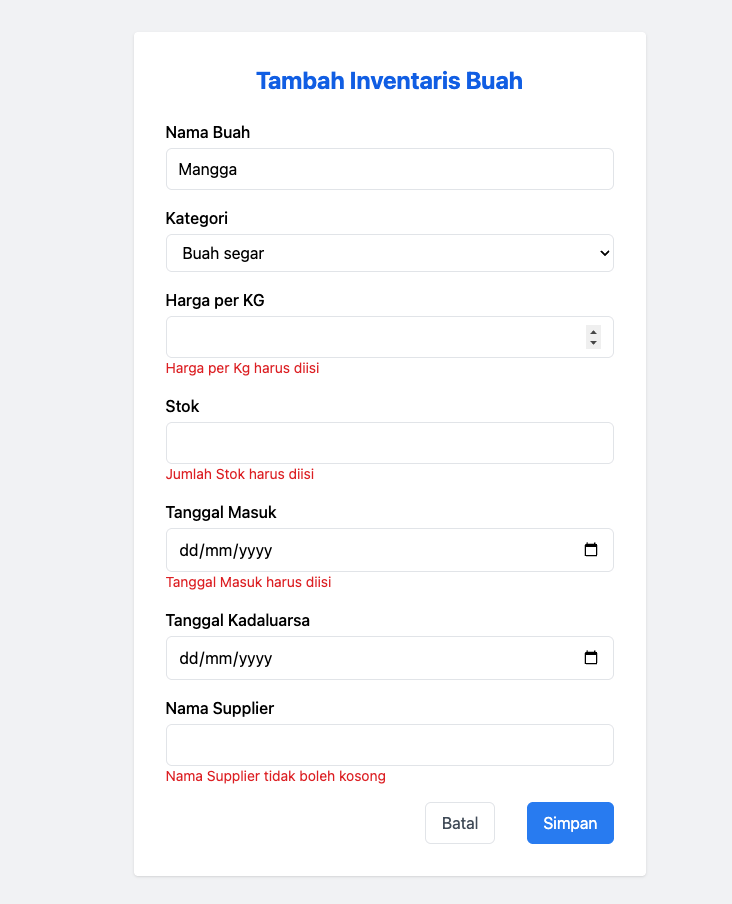
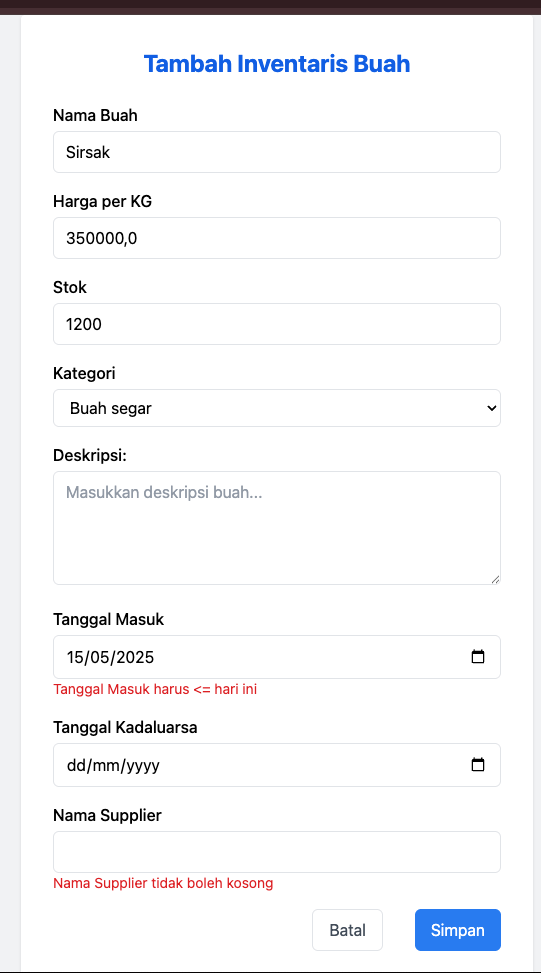
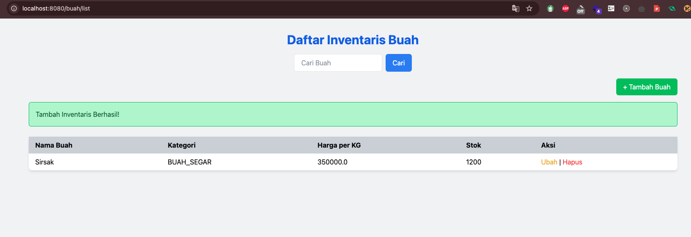
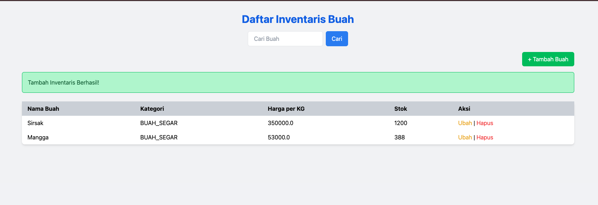
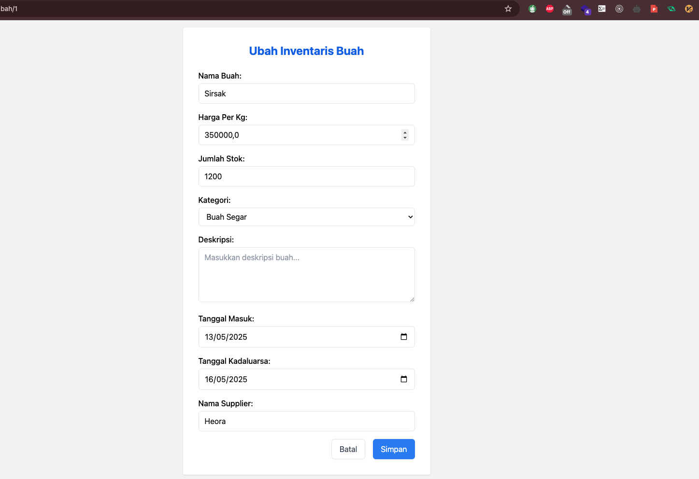
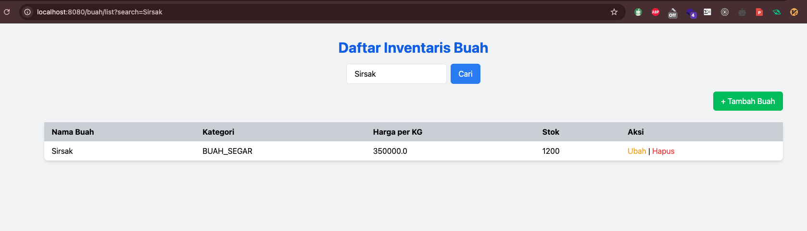
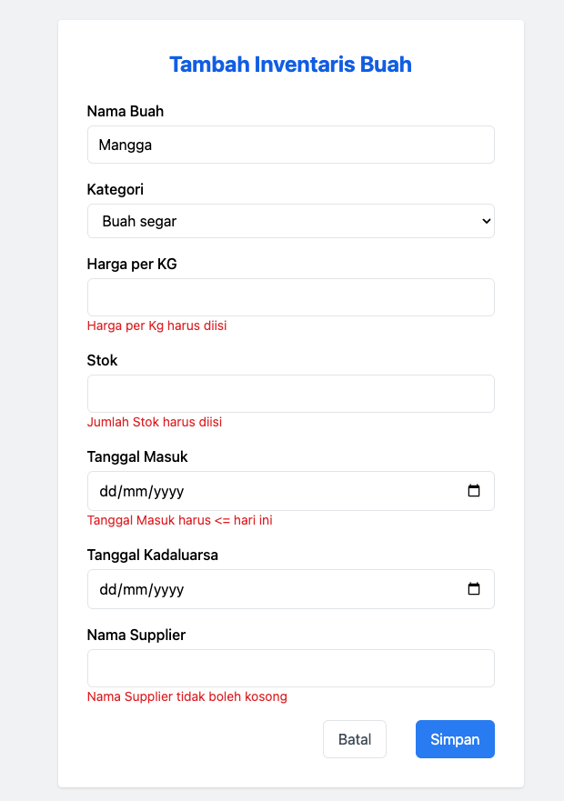

# Dokumentasi Aplikasi Inventaris Buah

## A. Tampilan Aplikasi dan Fungsi yang Ada

Aplikasi Inventaris Buah memiliki beberapa tampilan utama:

1. **Halaman Tambah Inventaris Buah**  
   ➤ Menyediakan form untuk memasukkan data buah baru ke dalam sistem.

2. **Halaman Master Inventaris Buah**  
   ➤ Menampilkan daftar semua data buah. Dilengkapi fitur pencarian, ubah, dan hapus.

3. **Halaman Ubah Inventaris Buah**  
   ➤ Menyediakan form untuk memperbarui data buah yang telah tersimpan.

---

## B. Hasil Pengujian Aplikasi Inventaris Buah

### 1. Halaman Tambah Inventaris Buah

- ✅ **Validasi Field**  
  Semua field wajib diisi (nama, harga, stok, tanggal masuk, supplier). Jika ada yang kosong, sistem menolak penyimpanan dan menampilkan pesan error.

  

- ✅ **Action Tambah**  
  Jika semua input valid, data berhasil disimpan ke database dan pengguna diarahkan ke halaman Master Inventaris.

  

- ✅ **Action Batal**  
  Tombol Batal membawa pengguna kembali ke halaman Master Inventaris tanpa menyimpan perubahan.

### 2. Halaman Master Inventaris Buah

- ✅ **List Inventaris tanpa Filter Pencarian**  
  Secara default menampilkan semua buah yang tersimpan.

  

- ✅ **List Inventaris dengan Filter Pencarian**  
  Pengguna dapat mencari buah berdasarkan nama. Daftar akan diperbarui secara dinamis sesuai input.

  

- ✅ **Action Ubah**  
  Mengarahkan pengguna ke halaman ubah dengan form yang sudah terisi data buah yang dipilih.

  

- ✅ **Action Delete**  
  Menghapus data buah dari database setelah konfirmasi.

  

### 3. Halaman Ubah Inventaris Buah

- ✅ **Validasi Field**  
  Sama seperti halaman tambah, semua field yang wajib akan divalidasi ulang.

  

- ✅ **Action Ubah**  
  Data diperbarui di database jika input valid dan pengguna akan diarahkan kembali ke halaman master dengan pesan sukses.

- ✅ **Action Batal**  
  Tidak menyimpan perubahan dan kembali ke halaman master.

---

## C. Kekurangan & Saran untuk Pengembangan Lebih Lanjut

- ❌ Tidak ada notifikasi berbasis pop-up atau toast saat aksi berhasil/gagal.
- ❌ Belum terdapat notifikasi hapus
- ❌ Belum ada fitur export ke Excel.
- ❌ Belum ada autentikasi user (siapa yang bisa tambah, ubah, hapus).

### Saran:

- ✅ Tambahkan notifikasi berbasis pop-up atau toast untuk memberikan umpan balik kepada pengguna.
- ✅ Implementasikan fitur export ke Excel untuk memudahkan pengguna dalam mengelola data.
- ✅ Tambahkan autentikasi user untuk meningkatkan keamanan aplikasi.
